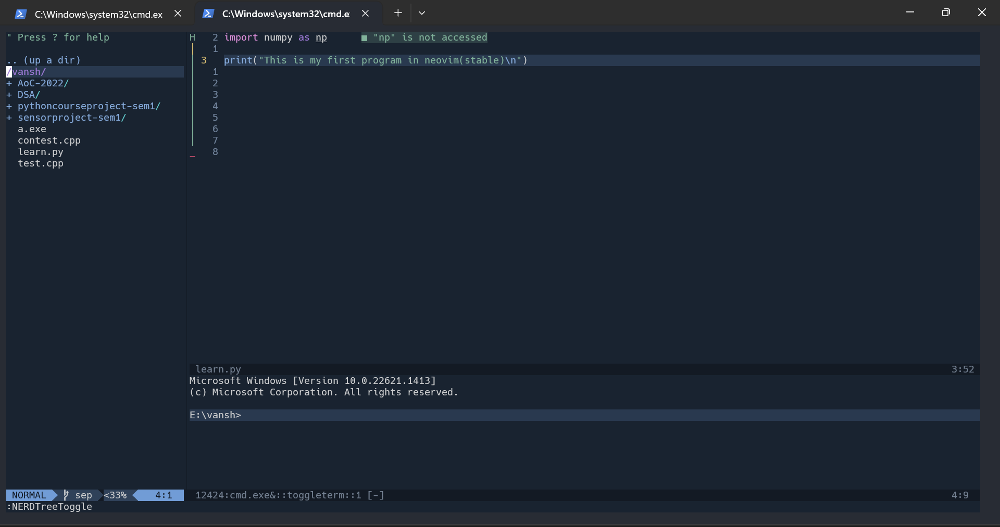

# **A basic config for neovim**
This is a simple configuraton for neovim in Windows(native not WSL) includes autocompletion for python, syntax highlighting, various key-maps(shortcuts) and a good theme.


## This is what it looks like



## Installation for Windows

1. Install neovim.
2. Make a directory named 'nvim' in `C:/Users/This Pc/AppData/Local`
3. Clone this repo into that folder using
4. Run neovim and install all the plugins

A detailed installation is given below


## Installation

Run `winget install Neovim.Neovim` for winget package manager. 
Run `choco install neovim` for chocolatey package manager. 
Or download it manually from refer to [this](https://github.com/neovim/neovim/wiki/Installing-Neovim) page for any queries

## Configuraton

Make a folder named nvim in `C:/Users/This Pc/AppData/Local`
Clone this repo in that folder or simply write 'git clone "https://github.com/vanshjangir/my-neovim-config"' in powershell after cd..ing into that folder

# Installing plugins
1. Run these two command in your powershell. These are package managers for nvim. 
```
iwr -useb https://raw.githubusercontent.com/junegunn/vim-plug/master/plug.vim |`
    ni $HOME/vimfiles/autoload/plug.vim -Force
```

```
git clone https://github.com/wbthomason/packer.nvim "$env:LOCALAPPDATA\nvim-data\site\pack\packer\start\packer.nvim"

```

2. Open the init.vim file by writing `nvim init.vim` in the nvim folder
3. Press ESC if you are not in normal (press it anyway just to make sure) and then type `:PlugInstall`. It will download somefiles let it happen and exit it by writing `:q` then exit nvim by writing `:wq`

4. Reopen the init.vim file in normal mode write `:PackerSync`. It will install somefiles let it happen then exit the window and you are good to go 


## Troubleshooting
1. There are only one or two ways that anything would go wrong. 
2. Make sure you have python installed.
3. If you are using chocolatey make sure to open powershell with administrator's privileges


